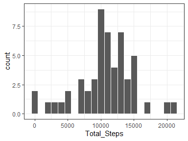
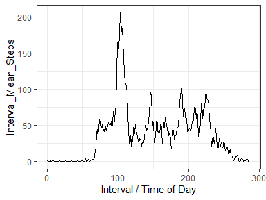
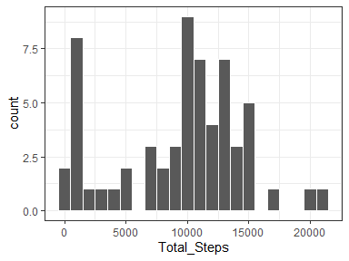
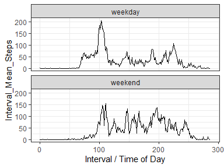

## Loading and preprocessing the data

These are the steps to unzip the compressed file, and read in the CSV file of activity data. the date column is converted to the Date data type. Days are converted to ordinal numbering, and intervals are converted into n ordinal values, corresponding to nth 5-minute intervals of that day.


```r
library(data.table)
unzip("activity.zip")
dat <- fread("activity.csv")
dat[, date := as.Date(date)]
dat[, day := frank(date, ties.method = "dense")]
dat[, tod := frank(interval)-1, by=date]
setkey(dat,date,interval)
```


## What is mean total number of steps taken per day?

A histogram displays of the number of steps taken each day, in thousand-step increments/bins. 


```r
library(ggplot2)
daily_steps <- dat[!is.na(steps), .(Total_Steps = sum(steps, na.rm=T)), by=date]

ggplot(data=daily_steps, aes(Total_Steps)) + 
    geom_histogram(color="white", binwidth=1000) + 
    theme_bw()
```

<!-- -->

The mean and median total number of steps taken by day are reportedin a single data frame.


```r
daily_steps[, .(Mean_Daily_Steps = mean(Total_Steps), 
                Median_Daily_Steps = median(Total_Steps))]
```

```
##    Mean_Daily_Steps Median_Daily_Steps
## 1:         10766.19              10765
```


## What is the average daily activity pattern?

Here is a time series plot of the average number of steps taken across all days (y-axis) per interval (x-axis). 


```r
interval_steps <- dat[!is.na(steps), .(Interval_Mean_Steps = mean(steps, na.rm=T)), by = tod]
ggplot(data = interval_steps) + geom_line(aes(x=tod, y = Interval_Mean_Steps)) + 
    xlab("Interval / Time of Day") + 
    xlim(c(0,288)) + theme_bw()
```

<!-- -->

Regarding the maximum average steps per day:


```r
max_step_tod <- interval_steps[Interval_Mean_Steps == max(Interval_Mean_Steps, na.rm=T)][, tod]
max_step_interval <- dat[tod == max_step_tod][1,interval]
time_of_day <- paste0(floor(max_step_tod*5/60), ":", (max_step_tod*5) %% 60)
print(paste("nth interval:", max_step_tod))
```

```
## [1] "nth interval: 103"
```

```r
print(paste("interval:", max_step_interval))
```

```
## [1] "interval: 835"
```

```r
print(paste("time of day:",time_of_day))
```

```
## [1] "time of day: 8:35"
```

On average across all the days in the dataset, the **103**rd interval contains the maximum number of steps. This is also marked as **835** in the orginal data set, and occurs at **8:35**.


## Imputing missing values

The total number of missing values in the dataset is 2304.


```r
print(paste("There are", dat[is.na(steps), .N], "missing values in the original dataset."))
```

```
## [1] "There are 2304 missing values in the original dataset."
```

By using the median value of the appropriate 5-minute interval, we fill in the missing values in dat, and create a new more complete dataset called 'new_dat'.


```r
new_dat <- copy(dat) 
str(dat)
```

```
## Classes 'data.table' and 'data.frame':	17568 obs. of  5 variables:
##  $ steps   : int  NA NA NA NA NA NA NA NA NA NA ...
##  $ date    : Date, format: "2012-10-01" "2012-10-01" ...
##  $ interval: int  0 5 10 15 20 25 30 35 40 45 ...
##  $ day     : int  1 1 1 1 1 1 1 1 1 1 ...
##  $ tod     : num  0 1 2 3 4 5 6 7 8 9 ...
##  - attr(*, ".internal.selfref")=<externalptr> 
##  - attr(*, "sorted")= chr  "date" "interval"
##  - attr(*, "index")= int 
##   ..- attr(*, "__tod")= int  1 289 577 865 1153 1441 1729 2017 2305 2593 ...
```

```r
### Calculate median number of steps in temporary column, 
### for intervals on days that don't have NAs.
new_dat[, int_med := median(steps, na.rm=T), by = interval]
### Assign median interval value of steps to days that do have NA values.
new_dat[is.na(steps), steps := int_med]
### Remove the temporary column.
new_dat[, int_med := NULL]
```

Here is a histogram of the total number of steps taken each day, according to the new data set.


```r
new_daily_steps <- new_dat[!is.na(steps), .(Total_Steps = sum(steps, na.rm=T)), by=date]
ggplot(data=new_daily_steps, aes(Total_Steps)) + geom_histogram(color="white", binwidth=1000) + theme_bw()
```

<!-- -->

Below we re-calculate the mean and median total number of steps taken per day. 


```r
rbind(
    daily_steps[, .(Data = "dat", Mean_Daily_Steps = mean(Total_Steps), Median_Daily_Steps = median(Total_Steps))]
    ,new_daily_steps[, .(Data = "new_dat", Mean_Daily_Steps = mean(Total_Steps), Median_Daily_Steps = median(Total_Steps))]
)
```

```
##       Data Mean_Daily_Steps Median_Daily_Steps
## 1:     dat        10766.189              10765
## 2: new_dat         9503.869              10395
```

Both the mean/median values of the new data set are lower in value than the estimates from the first part of the assignment. Substituting missing data with with mean/median values may bias the population to a lower number of average steps per day, because many of the 5-minute time periods had 0 as a legitimate value.

## Are there differences in activity patterns between weekdays and weekends?

A new factor variable with two levels -- "weekday" and "weekend" -- is created:


```r
new_dat[, week := as.factor(ifelse(weekdays(date) %in% c("Saturday","Sunday"), "weekend", "weekday")) ]
```

The plots below show the differences between weekend and weekday step activity patterns. On weekdays, the subect performs a maximal amount of steps early in the morning with a smaller step frequency for the remainder of the day. On weekends, activity starts generally later than on weekdays, but maintains a more conssitent level of activity through the waking hours.


```r
new_interval_steps <- new_dat[!is.na(steps), .(.N, Interval_Mean_Steps = mean(steps, na.rm=T)), by = c("tod","week")]
ggplot(data = new_interval_steps) + 
    geom_line(aes(x=tod, y = Interval_Mean_Steps)) + 
    facet_wrap(. ~ week, nrow = 2) +
    xlab("Interval / Time of Day") + 
    xlim(c(0,288)) + theme_bw()
```

<!-- -->
